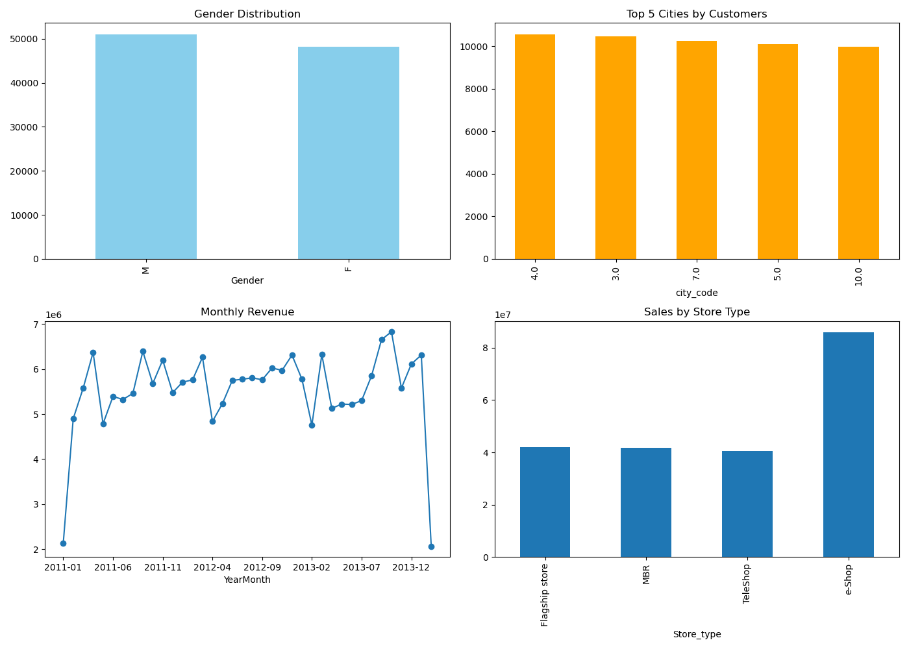

# Retail_Case_Study

# 🛍️ Retail Case Study — Customer Analytics & Transaction Insights

Welcome to the Retail Case Study project! This notebook performs an end-to-end analysis of customer transactions, sales behavior, product trends, and revenue insights using Python, Pandas, and visualization libraries. It is based on real-world-style retail data and structured for learning, portfolio building, and business case reporting.

---

## 📌 Objective

The primary objective of this case study is to analyze a retail dataset to:

- Understand customer behavior
- Identify high-performing product categories
- Examine store-wise performance
- Uncover insights from transaction trends
- Visualize data to communicate key findings

This project is part of a broader customer intelligence goal — to turn raw data into meaningful business insights.

---

## 📂 Dataset Overview

The data is provided in three separate CSV files:

| File               | Description                                      |
|--------------------|--------------------------------------------------|
| `Customer.csv`     | Contains customer demographics and identifiers   |
| `Transactions.csv` | Purchase and return transactions of customers    |
| `prod_cat_info.csv`| Product categories and subcategories             |

---

## 🧠 Key Questions Answered

1. ✅ Merge and clean datasets
2. ✅ Create summary statistics and frequency tables
3. ✅ Generate histograms for continuous variables and bar plots for categoricals
4. ✅ Analyze time period of transaction data
5. ✅ Identify negative transaction behavior
6. ✅ Determine product preferences by gender
7. ✅ Identify city with maximum customers and its percentage
8. ✅ Store type performance (by value and quantity)
9. ✅ Total earnings from selected categories and stores
10. ✅ Customer retention analysis (10+ unique transactions)
11. ✅ Age group analysis for 25–35-year-olds, including:
    - Spend on Electronics & Books
    - Spend during Jan–Mar 2014

---

## 📈 Visualizations

The project includes a wide range of exploratory and business-focused charts:

- 📊 **Bar plots** – Product popularity by gender, store performance
- 📉 **Line chart** – Monthly revenue trend over time
- 📍 **Pie chart** – Gender distribution
- 🔥 **Heatmap** – Total sales by product category and store type
- 🌍 **Bar chart** – Top 5 cities by customers and revenue

---

### 📊 Dashboard Preview

A visual summary of insights, combining key charts into one snapshot.  
📌 Make sure to open this image in full to view trends at a glance.

---

## 🛠️ Tools & Libraries Used

- **Python 3.x**
- **Pandas** – data wrangling
- **Matplotlib & Seaborn** – data visualization
- **NumPy** – calculations and date logic
- **Jupyter Notebook** – interactive analysis

---

